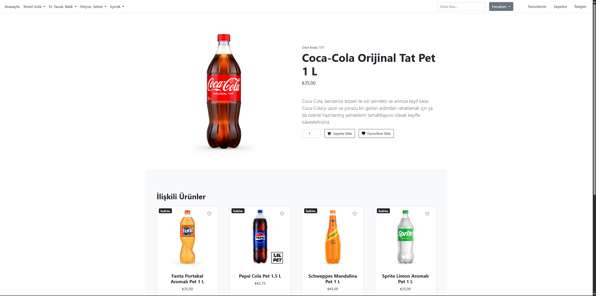
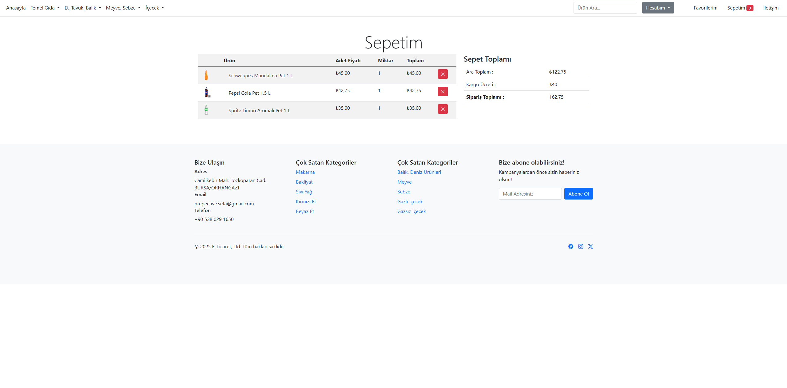
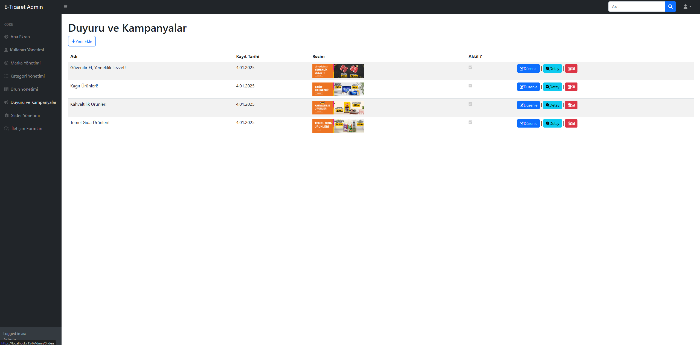
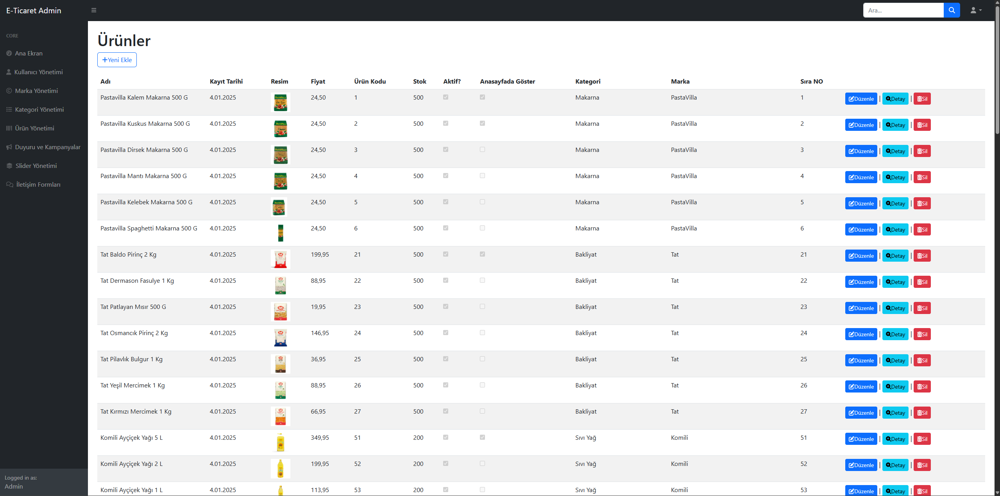

# 🛒 E-Ticaret MVC Projesi

Bu proje, bir e-ticaret web uygulamasının temel işlevlerini içeren ASP.NET MVC ile geliştirilmiş örnek bir sistemdir. Kullanıcılar ürünleri görüntüleyebilir, sepete ekleyebilir, favorilere alabilir ve kampanyaları takip edebilir. Ayrıca bir **Admin Paneli** üzerinden ürün ve kategori yönetimi yapılabilir.

## 🚀 Özellikler

- 👨‍👩‍👧‍👦 Kullanıcı Girişi ve Kayıt Sistemi
- 🛍️ Ürün listeleme, detay ve filtreleme
- ❤️ Favori ürün ekleme/silme
- 🛒 Sepet yönetimi ve toplam hesaplama
- 📰 Kampanya & Slider yönetimi
- 🧾 Sipariş özeti ve sepet detayları
- 🛠️ Yönetici panelinden:
- 🛠️ Ürün, marka, kategori ve slider yönetimi
- 📢 Kampanya/duyuru ekleme, düzenleme, silme
- 🔎 Ürün arama özelliği

---

## 🛠️ Kullanılan Teknolojiler

- **ASP.NET MVC 5**
- **C#**
- **Entity Framework**
- **SQL Server**
- **HTML5, CSS3, Bootstrap**
- **JavaScript & jQuery**

---
## 📸 Ekran Görüntüleri

### Anasayfa

### Kampanyalar

### Ürün Detayı

### Sepet Sayfası

### Admin Paneli - Kampanya Yönetimi

### Admin Paneli - Ürün Yönetimi
